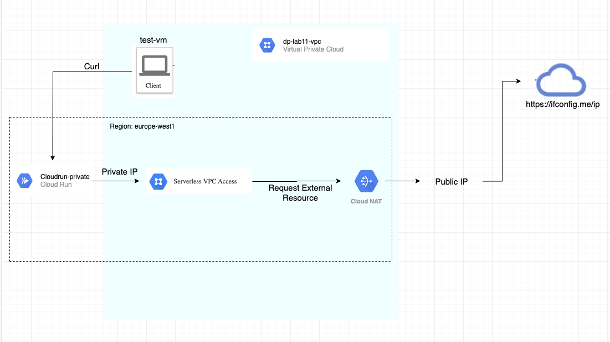

# Cloud Run deployment using Serverless VPC Connector
This allows serverless environments such as Cloud Functions, Cloud Run and App Engine standard environment apps to access resources in a VPC network using their private IPs.

This diagram is presenting how the connector will allow the private cloud run service to send an outbound request to an external endpoint using Cloud Nat’s public IP.

To test this deployment, we will build a docker image using python flask application. The app queries https://ifconfig.me/ip and sends its result back. We will use this image to deploy a private cloud run service.

# This deployment needs to be done in stages - targeted deploymenmt
1. Deploy resources needed to build the docker image
   
   a. Create a bucket: 
    * terraform apply -target="google_storage_bucket.bucket"
    * terraform apply -target="google_storage_bucket_object.temp_logs"
    
   b. Create Artifact Registry
    * terraform apply -target="google_project_service.artifactregistry"
    * terraform apply -target="google_artifact_registry_repository.repo"

2. Deploy docker image 

    a. Change directory
    * cd ifconfig

    b. Create environment variables for the region, project ID
    * export REGION=enter region
    * export PROJECT_ID=enter project ID

    c. Configure Docker authentication for the Artifact Registry
    * gcloud auth configure-docker ${REGION}-docker.pkg.dev

    d. Enable Cloud Build API
    * gcloud services enable cloudbuild.googleapis.com

    e. Start the image build process
    * gcloud builds submit --project ${PROJECT_ID} --gcs-log-dir=gs://${PROJECT_ID}-bucket --gcs-source-staging-dir=gs://${PROJECT_ID}-bucket/temp-logs --tag ${REGION}-docker.pkg.dev/${PROJECT_ID}/images/image:tag1 . 

    f. Change directory
    * cd ..

    g. Note down the image to be used in later stage

3. Deploy Serverless VPC Connector
    * terraform apply -target="google_project_service.vpcaccess"
    * terraform apply -target="module.serverless-connector"

4. Add docker image and serverless vpc connector in cloud run code

5. Deploy the remaining resources
    * terraform apply

6. Test ifconfig app

    a. SSH to sso-serverless-lab-vm
    * gcloud compute ssh vm instance --zone zone --tunnel-through-iap

    b. Run curl command with cloud run url
    * curl -H "Authorization: Bearer $(gcloud auth print-identity-token)" https://cloudrun-url

After deploying Clour Run with Serverless VPC Connector, ifconfig app returns CLoud NAT's Outbound IP. 