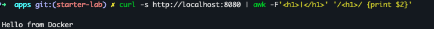
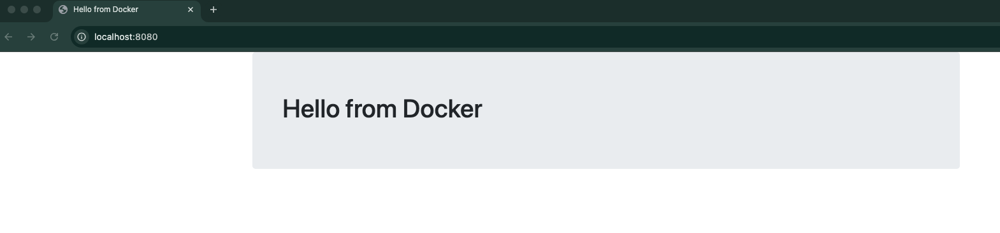
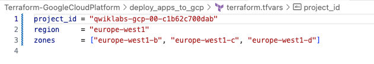

<!-- Overview -->
## Overview

In this lab, you will gain hands-on experience deploying a cloud-based application using Google Cloud Platform (GCP) services.
You will learn to build and push container images to Google Artifact Registry using Docker, preparing their application for deployment.
The lab will also introduce Google App Engine and Cloud Run, showcasing how to deploy containerized applications effortlessly while benefiting from automatic scaling and serverless capabilities.
Finally, the lab will demonstrate how to create a Kubernetes cluster, configure a Deployment resource to manage application instances, and expose the application using a Load Balancer Service.

# Prerequisites
* Google Cloud Platform (GCP) Account
* IAM Permissions on GCP project:
  * Viewer
  * Editor
  * Kubernetes Engine Admin
  * Cloud Run Admin
  * Cloud Build Editor
* Google Cloud SDK (gcloud)
* Docker 
* Terraform

<!-- Task1 -->
## Clone the code for this lab and change directory to deploy_app_to_gcp/
  ```sh
  git clone https://github.com/agapasieka/Terraform-GoogleCloudPlatform.git
  cd Terraform-GoogleCloudPlatform/deploy_apps_to_gcp
  ```  

<!-- Task2 -->
## Build test docker image and run application locally
To build our test image and deploy to docker container for testing, head out to apps folder. 
We need the following config files:
* Dockerfile
* main.py
* requirements.txt
* templates folder includes index.html and layout.html files

1. Build the **test-python-app** image
  ```sh
  cd apps/
  docker build -t test-python-app .
  ```  

2. Run the Docker container to test the app
  ```sh
  docker run --name hello-from-docker --rm -d -p 8080:8080 test-python-app
  ```

3. Test the app in terminal 
  ```sh
  curl -s http://localhost:8080 | awk -F'<h1>|</h1>' '/<h1>/ {print $2}'
  ``` 
  

4. Test the app in browser
  ```sh
  localhost:8080
  ``` 
 

5. Delete the container and local image
  ```sh
  docker rm hello-from-docker -f
  docker rmi test-python-app
  ``` 

<!-- Task3 -->
## Deploy to App Engine 

I will be using a similar app code for App Engine located in **apps/app-engine/** folder. I changed the body message to say: **Hello from App Engine** so we can be sure each deployment succeeded. 

Before we create any resources with terraform, verify the region defined in **terraform.tfvars** file. I used **europe-west1** but you can use any region of your choice. 

Add your **project ID** in **terraform.tfvars**, uncomment the first line to look like below:

 

To deploy to App Engine, we need to zip our code first and place it in the storage bucket. 

1. In **deploy-app-to-gcp/** locate the **bucket.tf** file, uncomment the code and save the file. Make sure you are in **deploy_apps_to_gcp** directory.

2. Deploy with terraform
  ```sh
  cd ..
  terraform init
  terraform apply
  ```   
3. Now let's deploy the App Engine. Uncomment code in **app-engine.tf** and save the file.
  ```sh
 terraform apply  
  ```

Wait for the deployment to finish. At the end terrafortm outputs the URL to an App Engine application. Click on the link to test the app. 


<!-- Task4 -->
## Deploy to Cloud Run
To use Cloud Run, you need to build a Docker image again and store it in Artifact Registry.

1. Let's first create an Artifact Registry repository named **devops-repo**. Uncomment code in **artifact-registry.tf** and save the file.

2. Deploy with terraform
  ```sh
  terraform apply
  ``` 
  
3. Configure Docker to authenticate to the Artifact Registry Docker repository. I used **europe-west1** as my region for all resources but if you changed it in **provider.tf** in previous step, update it here too.
  ```sh
   export REGION=europe-west1
   gcloud auth configure-docker $REGION-docker.pkg.dev
  ```
  
4. Build the image for Cloud Run. This time we will use Google Cloud Build to submit a build and create a container image. Change directory to cd apps/cloud-run/.
  ```sh
  cd apps/cloud-run/
  gcloud builds submit --tag $REGION-docker.pkg.dev/$DEVSHELL_PROJECT_ID/devops-repo/cloud-run-image:v0.1 .
  ```

5. Deploy Cloud Run, uncomment the code in **cloud-run.tf**, save it and run below command. 
  ```sh
  cd ../../
  terraform apply 
  ```

Wait for the deployment to finish. At the end terrafortm outputs the URL to a Cloud Run application. Click on the link to test the app. 

<!-- Task5 -->
## Deploy to Kubernetes Engine

To deploy an application to Kubernetes, you must first create the cluster. Next, you'll need to provide a configuration file to enable the deployment of your application to the cluster.
We will also build another Docker image using Cloud Build and store it in devops-repo Artifact Registry. The Python app config files are located in apps/gke-config folder. 

1. Deploy GKE cluster and VPC, uncomment the code in **vpc.tf**, **service-accounts.tf** and **gke.tf**.

2. Deploy with terraform
   We are using public terraform modules for vpc and gke so we must reinitialize terraform. Make sure you are still in **deploy_apps_to_gcp** directory.
  ```sh
  terraform init
  terraform apply
  ``` 

If you get a provider error, run  **terraform init -upgrade**

3. Change directory to **apps/gke-config/** and build the image
  ```sh
  cd apps/gke-config/
  gcloud builds submit --tag $REGION-docker.pkg.dev/$DEVSHELL_PROJECT_ID/devops-repo/gke-image:v0.1 .
  ```

In **apps/gke-config/** directory locate file named **kubernetes-config.yaml**. 
This YAML file defines two key resources: a **Deployment** and a **Service**. 
In **Deployment** section we are deploying 3 instances of our Python web app and specifying the image we just build. 
A **Service** part provides an endpoint for accessing a set of pods, allowing for load balancing and discovery.

4. Add image to **kubernetes-config.yaml**. Use nano or vim to edit the file.
  ```sh
  nano kubernetes-config.yaml
  ```
Look for line: **<YOUR IMAGE PATH HERE>** and replace with the image url we just created. 
Save the file by using **Ctrl + X, Y, Enter**.

5. Authenticate to cluster
  ```sh
  CLUSTER_NAME=$(gcloud container clusters list --project $DEVSHELL_PROJECT_ID --region $REGION --format "value(name)" | head -n 1)
  gcloud container clusters get-credentials $CLUSTER_NAME --region $REGION --project $DEVSHELL_PROJECT_ID
  ```

6. To deploy our application run the following command.
  ```sh
    kubectl apply -f kubernetes-config.yaml
  ```

7. Verify whether three instances of application have been created.
  ```sh
    kubectl get pods
  ```

8. Verify the load balancer IP address to test the application.
  ```sh
    kubectl get services
  ```
If the load balancer's external IP address says **pending**, wait a few seconds and try again.

9. To test the app, open the browser and use: **http://EXTERNAL-IP:8080**

10. Alternatively, test with curl.
  ```sh
  curl -s http://EXTERNAL-IP:8080 | awk -F'<h1>|</h1>' '/<h1>/ {print $2}'
  ```

## Lab clean-up 
```sh
kubectl delete -f apps/gke-config/kubernetes-config.yaml
terraform destroy
```

## The End
